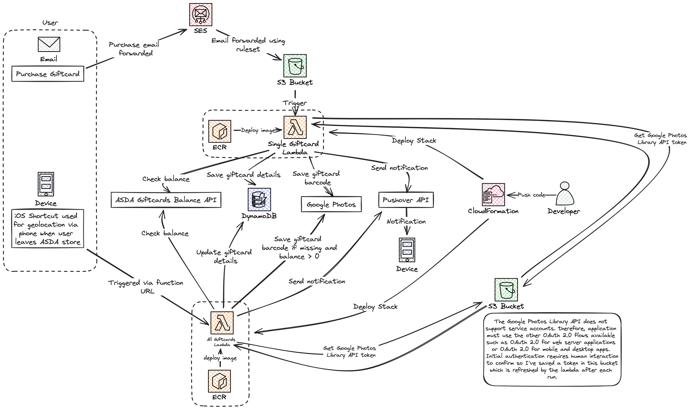

# Giftcard Management
Containerised lambdas for tracking and storing ASDA giftcards

## Intent
In light of the significant value of unused gift cards in the US, this script aims to manage and maximize the usage of gift cards, particularly ASDA gift cards, obtained through an employee perks and discount program.

- The estimated value of unused gift cards in the US was $3 billion at the end of 2019 (Source: Investopedia)
- According to Bankrate, 51% of U.S. adults have unused gift cards, vouchers, or store credits.
- Finder.com reported that Americans have an average of $116 in unused gift cards.

The primary goal of this script is to efficiently track ASDA gift cards obtained through my employer's employee perks program. 
By doing so, it ensures these gift cards are utilized effectively and prevents them from going unused.

## Architecture Diagram



### Why Dynamodb over RDS?
Given the requirements of this project, DynamoDB seems to be a more suitable choice than RDS. DynamoDB's ability to handle unstructured data and its seamless integration with AWS Lambda and S3 make it ideal for this application. Its scalability and performance are beneficial for handling the variable load and data structure of gift card information. Additionally, the use of DynamoDB aligns well with the serverless architecture of AWS Lambda, providing a more streamlined and efficient solution for this specific use case. DynamoDB is managed by AWS, reducing the overhead of database maintenance and management. If this application heavily relied on complex queries, transactions, or relational data operations, RDS may have been a better fit. 

### Why lambda over EC2/Fargate?
- **Event-Driven Architecture**: Lambda functions are ideal for event-driven applications. In this project, functions are triggered by specific events (like the arrival of an email in an S3 bucket).
- **Scalability**: Lambda automatically scales based on the number of incoming requests, which can be beneficial for handling fluctuating workloads without manual intervention.
- **Cost-Effectiveness**: Lambda charges are based on the actual usage (compute time and number of requests), which can be more cost-effective for applications with variable or sporadic traffic.

## Design

The script functions as follows:

- **Email Integration**: Upon the purchase of a gift card, the corresponding email is automatically forwarded to an S3 bucket via SES.
- **Automated Trigger**: The arrival of an email in the S3 bucket triggers an AWS Lambda function.
- **Lambda Function**: The lambda function executes the following tasks:
  - It interacts with the ASDA Giftcards balance API to check the balance of the received gift card.
  - It saves the gift card information to my Google Photos and Dynamodb for easy and convenient access.
  - Executes the `pushover` API to send a notification of the gift card number and balance to my phone.

As I have a few projects that use similar code I created this package for them: [commons-shared-library](https://github.com/addenergyx/common-shared-library)


## Response
```
{
    "statusCode": 200,
    "body": {
        "message": "Giftcard lambda invoke successful",
        "Balance": 6.48,
        "Added": [],
        "Deleted": [
            "giftcard_6314380605502977.png",
            "giftcard_6314380606090142.png",
            "giftcard_6314380605304854.png",
            "giftcard_6314380654077532.png",
            "giftcard_6314380656222310.png"
        ]
    }
}
```
